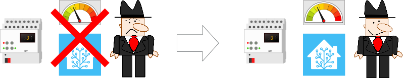

# hass-AMS - AMS Reader for Norwegian and Swedish AMS meters



[](https://github.com/custom-components/hacs)
<a href="https://www.buymeacoffee.com/turbokongen" target="_blank"></a>

Custom component reading [AMS](https://no.wikipedia.org/wiki/Smart_str%C3%B8mm%C3%A5ler)
through MBus adapter into [HomeAssistant](https://www.home-assistant.io/).
Supports the new energy dashboard in Home-Assistant.

## Electricity meter hardware

Works with the following Swedish and Norwegian meters:

### Kamstrup:

- 6861111 tested by janna at homeassistant community forum
- 6841121 tested by me
- 6841131
- 6841138A tested by NilsFA at homeassistant community forum
- 6851121
- 6851131

### Kaifa:

Norway:

- MA304H3E Thanks to @thomasja27 for testing :+1:
- MA105H2E Thanks for confirming: @Futrax

Sweden:

- MA304H4 Thanks to @runlar for testing (Swedish version) :+1:

Not tested with, but should work:

- MA304T4
- MA304T3

### Aidon:

Norway:

- 6525 Thanks to @razzymoose for testing and providing patch :+1:
- 6515 Thanks to @maxgyver87 for fault finding and testing :+1:
- 6534 Thanks to @mariwing for testing and debugging :+1:
- 6483 Thanks @PerBob81 for confirming :+1:

Sweden:

- 6484 Thanks to @bo1jo for testing and debugging :+1:

Not tested with, but should work:

Norway:

- 6540
- 6550

Sweden:

- 6479

If it does not decode your data, please submit a ticket, and I will try to
make a parser for your meter.
If your meter type shown "unknown", please submit a ticket, and I will add
your meter to the module.

## Home-assistant installation

Easiest method is to install via [HACS](https://hacs.xyz/).
Then setup via *Integrations* config.

*Or*

1. Copy `ams` folder into your `custom_components` folder.
2. Config by YAML setup or config by integrations in Home-assistant

### YAML options

```yaml
ams:
  serial_port: '/dev/ttyUSB0' # Required. The serial port used to communicate through
  baudrate: 2400 # Optional, defaults to '2400'
  parity: 'N'  # Optional, defaults to 'N'
  meter_manufacturer: 'auto' # Optional, defaults to 'auto'
```

Start Home-Assistant and
set up the integration in the *Integrations* config if you haven't set up by YAML config.

For `parity` values see <https://github.com/pyserial/pyserial/blob/master/serial/serialutil.py#L79>

For `meter_manufacturer` values the options are:

```python
'auto'
'aidon'
'aidon_se' # Swedish aidon meter RF2 modules
'kamstrup'
'kaifa'
'kaifa_se' # Swedish kaifa meters
```

This will create sensors for each of the available usage data in the meter.
The accumulative sensors will only be fully available after first read, and is transmitted from the meter 5 seconds past the hour.
There seems to be a bug in the current Kamstrup firmware that the hour package is transmitted at xx:xx:55.

## MBus interface hardware

### *Known working modules*

- [USB to MBUS slave module MBUS master slave communication debugging bus monitor TSS721](https://www.aliexpress.com/item/32894249052.html)
- [TSS721 Module M-BUS To TTL with RX TX Indicator STM32 Development](https://www.aliexpress.com/item/32751482255.html?spm=2114.10010108.1000014.1.2a3189f8fCOsSM)
- [TTL to MBUS, Serial to MBUS Slave Module, Instead of TSS721A, Signal Isolation](https://www.ebay.com/itm/273122508071?_trkparms=amclksrc%3DITM%26aid%3D1110006%26algo%3DHOMESPLICE.SIM%26ao%3D1%26asc%3D20201210111314%26meid%3D4ae500c42d6c43dba4fbc3c8ed06db95%26pid%3D101195%26rk%3D1%26rkt%3D12%26sd%3D274011702607%26itm%3D273122508071%26pmt%3D1%26noa%3D0%26pg%3D2047675%26algv%3DSimplAMLv9PairwiseWebMskuAspectsV202110NoVariantSeed%26brand%3DUnbranded&_trksid=p2047675.c101195.m1851&amdata=cksum%3A2731225080714ae500c42d6c43dba4fbc3c8ed06db95%7Cenc%3AAQAGAAABEIIp3bTCXFAKw6S9crk9CpCrrtOgadqFiC10NVPbN0936eprYVB4SXfDa52e1mbPLFwdBXChmaGoQQy%252BBr%252F%252B6GwMcxzo7LNbOSruw8JYl4DlyP7oF0HAfDyaq70zO7kJ5TaNT4YP7AkcEgketK%252BSXiNU63J9O%252FNGJW%252FFzn%252B66oRh%252Ff51%252FOd%252BA7ejgOOSfiKyvRVua%252FiFnXrxVBuK6ejVzVdYQ8RkXWB%252BnAu4penvUGurSKh3gR%252B7GDYFpsU4WtTtZ59xj8h1jM8sf1rmoti2QMtmA6IzzxoTGR%252FY%252BwYIH5Ouq6dr2FeuKZP7nES3I5AT%252FKa7fdaUOT27KtkO6Rie2slNPzgZrUAyecfyWTwfQBCc%7Campid%3APL_CLK%7Cclp%3A2047675)

### *Known NOT working modules*

- [USB to MBUS slave module discrete component non TSS721 circuit M-BUS bus data monitor](https://www.aliexpress.com/item/32814808312.html?shortkey=iM7rQb67&addresstype=600)

## Technical documentation

Latest information about OBIS for all the Norwegian meters: <https://www.nek.no/info-ams-han-utviklere/>

Latest information about Swedish standard for AMS: <https://www.energiforetagen.se/globalassets/energiforetagen/det-erbjuder-vi/kurser-och-konferenser/elnat/branschrekommendation-lokalt-granssnitt-v2_0-201912.pdf>

## Feedback

Improvements and suggestions are also welcome.
Keep in mind, I am not a experienced programmer :)
Enjoy
